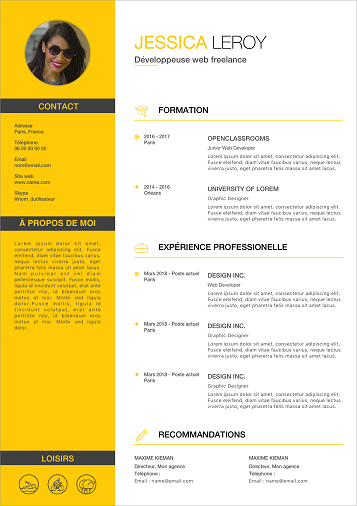

# Transformer mon cv en site web à partir d'une maquette 
[Mon cv en site web](https://hoarjer.github.io/CV-Jerome-Hoareau/)

## Compétences
* Intégrer du contenu conformément à une maquette

* Préparer des éléments graphiques et textuels à intégrer à une page web

* Adapter l'affichage d'un site web à des écrans de petite taille

* Utiliser un système de gestion de versions pour le suivi du projet et son hébergement (git, github et github-page)

* Définir la structure d'une page web à partir d'une maquette

* Assurer la conformité d'une page web aux standards HTML et CSS

model:

